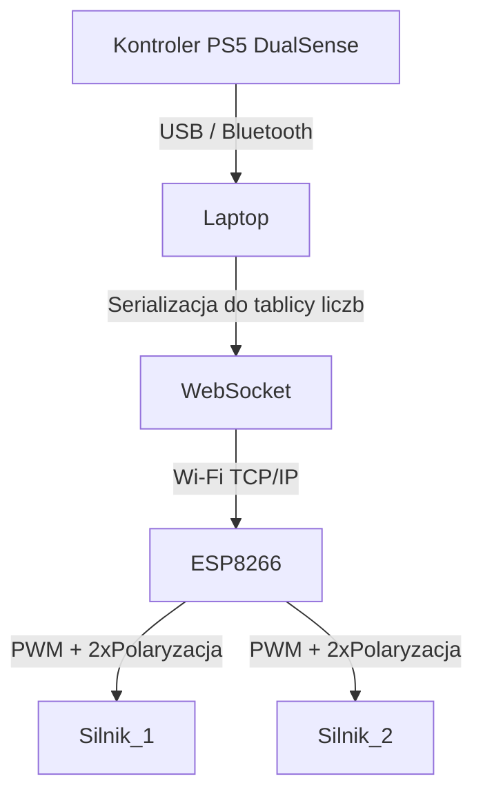

# 🚗 RCDC 2025 — Zwycięski Projekt Zdalnie Sterowanego Samochodu

[![Contributors][contributors-shield]][contributors-url]
[![Forks][forks-shield]][forks-url]
[![Stargazers][stars-shield]][stars-url]
[![MIT License][license-shield]][license-url]

> [!NOTE]  
> Konkurs **Remote Car Design Competition (RCDC)** to ogólnopolski konkurs inżynierski organizowany przez Stowarzyszenie Studentów BEST.
>
> To jedyny w Polsce konkurs projektowania zdalnie sterowanego pojazdu RC, tworzony przez studentów dla studentów. W edycji wzięło udział około 60 uczestników z całej Polski.

> [!IMPORTANT]
> **Kategoria:** Remote Car Development
> Celem było stworzenie pojazdu RC, który jak najszybciej pokona tor przeszkód, wykorzystując dostępne komponenty.

---

## 📚 Spis treści

1. [Architektura systemu](#-architektura-systemu)
2. [Wyniki i sukces](#-wyniki-i-sukces)
3. [Zdjęcia](#-zdjęcia)

---

## 🔄 Architektura systemu

System zapewnia płynne, analogowe sterowanie samochodem RC przy użyciu kontrolera PS5. Dane z pada trafiają do aplikacji Python na komputerze, są serializowane do tablicy liczb i przesyłane przez WebSocket do ESP8266, który steruje dwoma silnikami DC za pomocą PWM i dwóch bitów kierunku dla każdego silnika.

### 📊 Schemat przepływu danych:

### ⚙️ Technologie i narzędzia:

* Python 3.11 z biblioteką `dualsense-controller`
* WebSocket (`websockets`)
* ESP8266 D1 UNO + `ESPAsyncWebServer`
* Format komunikacji: `PWM1,DIR1_A,DIR1_B,PWM2,DIR2_A,DIR2_B` np. `200,1,0,150,0,1`
* Wysyłka tylko przy wykryciu zmiany — optymalizacja czasu i pasma

(<a href="#readme-top">powrót na górę</a>)

---

## 🏆 Wyniki i sukces

Projekt został wybrany jako **zwycięski** w kategorii Remote Car Development. Dzięki niskim opóźnieniom, precyzyjnemu sterowaniu i optymalnej architekturze komunikacyjnej, nasz samochód pokonał tor przeszkód w rekordowym czasie.

> [!TIP]
> Połączenie DualSense, WebSocket i ESP8266 zapewniło niezwykłą responsywność i precyzję prowadzenia.

(<a href="#readme-top">powrót na górę</a>)

---

## 📷 Zdjęcia

(<a href="#readme-top">powrót na górę</a>)

---

<!-- Shields -->

[contributors-shield]: https://img.shields.io/github/contributors/Niewiaro/RCDC-2025.svg?style=for-the-badge
[contributors-url]: https://github.com/Niewiaro/RCDC-2025/graphs/contributors
[forks-shield]: https://img.shields.io/github/forks/Niewiaro/RCDC-2025.svg?style=for-the-badge
[forks-url]: https://github.com/Niewiaro/RCDC-2025/network/members
[stars-shield]: https://img.shields.io/github/stars/Niewiaro/RCDC-2025.svg?style=for-the-badge
[stars-url]: https://github.com/Niewiaro/RCDC-2025/stargazers
[license-shield]: https://img.shields.io/github/license/Niewiaro/RCDC-2025.svg?style=for-the-badge
[license-url]: https://github.com/Niewiaro/RCDC-2025/blob/main/LICENSE
